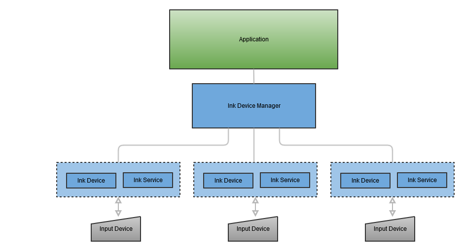
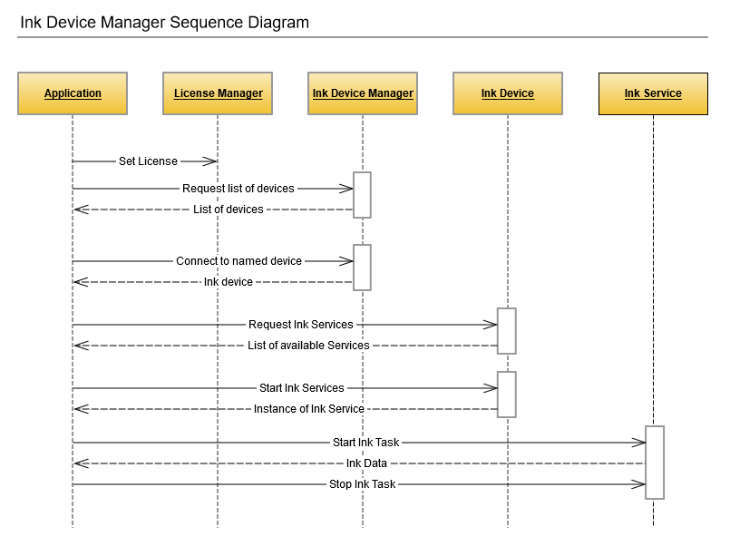

# Wacom Ink SDK for devices - Windows Classic

## Introduction to CDL - Windows Classic

---

The *Common Device Library* (CDL) is supplied as a single library that can handle different types of pen or touch input from Wacom and third-party devices.
The benefits of using the CDL include:

* Less implementation effort for developers: integration of a single library gives support for a range of input devices
* The flexibility to include support for non-Wacom devices in an application
* The freedom to take full advantage of the *Wacom Ink Technologies* digital ink ecosystem to provide high quality digital ink rendering without sacrificing the value of raw pen data needed in processes such as signature verification
* A generic interface relieves the application code from direct control of the connected hardware

Using the library you can:

* Search for available devices
* Connect to a device
* Receive input from a connected device in the WILL Ink format

The CDL is available for a range of development platforms

* Windows (Classic and UWP)
* iOS
* Android

Types of supported devices include:

* Wacom PHU-111 Clipboard
* Wacom Smartpad e.g. Folio, Slate
* Wacom Intuos
* Apple Pencil

Regardless of the development platform and device type a consistent approach is provided for application development:



### Ink Device Manager
    In Windows the Device Manager is implemented as a direct call to scan for connected devices. 
    The scan function returns a list of named devices that are available for connection.
### Ink Device
    Connect to a named device and retrieve properties
### Ink Service
    Use the service callback mechanism to receive data from the connected device.
    Depending on the type of device, data can be in the form of realtime pen strokes, or a file transfer of a completed page.

To view operation of the CDL diagrammatically:




## SDK Overview

---


### 1. Initialize License
You will need a CDL license, issued for your application:

```csharp
try 
{
    const string license = <license string>;

    Wacom.Licensing.LicenseManager.Instance.SetLicense(license);
} 
catch (Exception ex) {
    ...
}
```

### 2. Scan for Wacom Ink Devices

In order to find the available Wacom Ink Devices create a new instance of an ```InkDeviceWatcherUSB```: 

```csharp
InkDeviceWatcherUSB watcherUSB = new InkDeviceWatcherUSB();
```

To start watching for devices, connect events:

```csharp
watcherUSB.DeviceAdded += OnDeviceAdded;
watcherUSB.DeviceRemoved += OnDeviceRemoved;
watcherUSB.WatcherStopped += OnUsbWatcherStopped;
```

When the watcher finds a device, it calls the DeviceAdded handler with an ```InkDeviceInfo``` object:

```csharp
private void OnDeviceAdded(object sender, InkDeviceInfo info)
{
    var ignore = Dispatcher.RunAsync(CoreDispatcherPriority.Normal, () =>
    {
        ...
    });
}
```

When watching is complete you should disconnect events:

```csharp
watcherUSB.DeviceAdded -= OnDeviceAdded;
watcherUSB.DeviceRemoved -= OnDeviceRemoved;
watcherUSB.WatcherStopped -= OnUsbWatcherStopped;
```

### 3. Create & Connect an Ink Device

After a device has been found by a watcher, you can create an instance of ```InkDevice```. This is then used to communicate with and execute commands on the Wacom Ink Device. ```CreateDeviceAsync``` takes six parameters:

* ```deviceInfo``` - Device connection information.
* ```appId``` - A unique identifier for the application. It is used by ink devices to pair with the application.
* ```authorize``` - Specifies whether the method must perform pairing and authorization procedures. Set this parameter to true only when the InkDeviceInfo object is newly created by the InkDeviceWatcher. If the InkDeviceInfo parameter is created from deserialization set this parameter to false.
* ```encryption``` - A value indicating whether the device must use encrypted communication.
* ```OnDeviceStatusChanged``` - A handler for the UserActionRequired events that might be rised during initialization.
* ```OnPairingModeEnabled``` - (optional) A delegate that is called when the device is switched to pairing mode.

If you have already paired with a device before there is no need to use a watcher to find it again. You can just serialize the ```InkDeviceInfo``` and reuse it to recreate the the client.

```csharp
InkDevice device = await InkDeviceFactory.Instance.CreateDeviceAsync(deviceInfo, appId, true, false, OnDeviceStatusChanged);
```

When you have finished with the ink device, or if you need to create a new client, you should first dispose it -

```csharp
device.Dispose();
```

### 4. Device Services

Different Wacom ink devices have different features. In CDL these features are grouped into sets called Device Services. Under Windows, the Device Services supported are File Transfer and Real Time Ink. Note that these cannot work in parallel - if one of them is enabled, the other cannot be started until the first one is stopped.

DigitalInkDevice can raise a number of events, such as device disconnection or change of state, for example waiting for the user to tap the central button of the device in order to confirm a new connection.

Ink devices also have properties which describe some of their characteristics such as name, battery state, and dimensions. You can query the value of specific properties using the GetPropertyAsync method.

### 4.1. FileTransfer- Transfer Files From Ink Device

To receive all files created with a Wacom Ink Device, use the FileTransferService:

```csharp
IFileTransferService service = device.GetService(InkDeviceService.FileTransfer) as IFileTransferService;

if (service == null)
{
    // device does not support file transfer
}
else if (!service.IsStarted)
{
    await service.StartAsync(StrokesReceivedAsync, false, m_cts.Token);
}
```

```InkDocuments```, containing layered ink data, are received through the ```StrokesReceivedAsync``` callback


### 4.2. RealTimeInk - Get Real Time Inking

To receive ink data in real-time, use the RealTimeInkService:

```csharp
IRealTimeInkService service = device.GetService(InkDeviceService.RealTimeInk) as IRealTimeInkService;

if (service == null)
{
    // Realtime ink not supported
}
else if (!service.IsStarted)
{
    await service.StartAsync(false, m_cts.Token);
}
```

The sample app uses InkCanvas control to process and display captured digital ink.

Alternatively, there are three events through which you can receive data in real time:

* StrokeStarted - A new stroke was started.
* StrokeUpdated - A new part was added to the current stroke.
* StrokeEnded - The stroke was finished. Unlike the previous two events, this one also provides as a parameter ```InkStroke``` containing the data describing the whole stroke.

---

## Documentation
For further details on using the SDK see [http://will-docs.westeurope.cloudapp.azure.com/sdk-for-devices/) 

The API Reference is available directly in the downloaded SDK.

## Getting support
You can request developer support from the dedicated section on our
[developer relations portal.](http://will-docs.westeurope.cloudapp.azure.com/faqs/docs/q-support/support)

## Sharing your feedback ?

(##)Please share your feedback under: [Survey - WILL SDK for devices](https://www.surveymonkey.de/r/willsdkfordevices)

## License 
This sample code is licensed under the [MIT License](
https://choosealicense.com/licenses/mit/).
